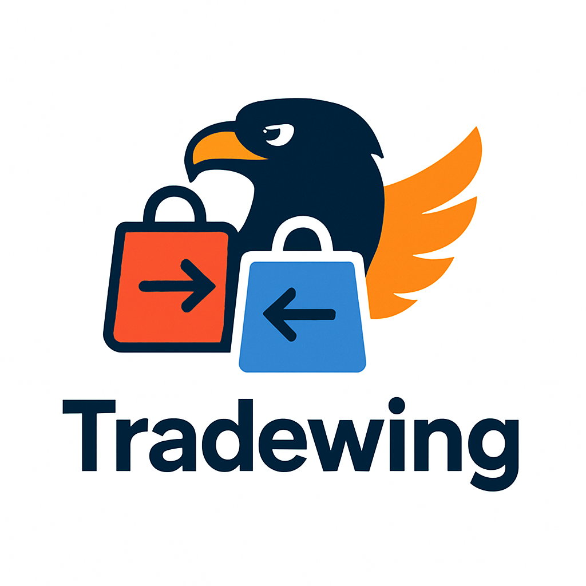

<a id="readme-top"></a>

<br />
<div align="center">
  <a href="https://github.com/GitDebaro/Tradewing">
    
  </a>

  <h3 align="center">TradeWing</h3>

  <p align="center">
    Buy & sell with ease
  </p>
</div>

<details>
  <summary>Table of Contents</summary>
  <ol>
    <li>
      <a href="#about-the-project">About The Project</a>
      <ul>
        <li><a href="#built-with">Built With</a></li>
      </ul>
    </li>
    <li>
      <a href="#installation">Instalation</a>
    </li>
    <li><a href="#contact">Contact</a></li>
  </ol>
</details>

## About The Project

Tradewing is a web application designed to facilitate the buying and selling of second-hand products between individuals over the internet. It allows users to post used items, which can be viewed and purchased by anyone with internet access.

The application is aimed at people of all ages with basic internet browsing skills who are interested in selling or acquiring used products.

The main goal of Tradewing is to create a functional and accessible web platform that promotes the exchange of second-hand goods between individuals, supporting the circular economy and offering a practical, fast, and affordable alternative to traditional consumption.

<p align="right">(<a href="#readme-top">back to top</a>)</p>

### Built With

* [](https://spring.io/projects/spring-boot)
* [](https://vuejs.org/)
* [](https://tailwindcss.com)
* [](https://developers.google.com/identity)
* [](https://stripe.com)

<br/>
<div align="center">
  
</div>
<br/>

<p align="right">(<a href="#readme-top">back to top</a>)</p>

## Installation

This project has been developed using Maven as Java Compiler. The frontend is entirely set on Vue.js. It's highly recommended to have Node.js installed.

Follow these steps to set up the project locally:

### 1. Clone the repository

```bash
git clone https://github.com/GitDebaro/Tradewing.git
cd Tradewing
```
### 2. Install dependencies

```bash
npm install
(This step is optional, the pom.xml will install the dependencies before compiling)
```

### 3. Set up enviroment variables

You should have this variables in a .env file in the root directory of the project

```
DB_URL   (Using jdbc protocol)
JWT_SECRET   (Key for token generation)
GOOGLE_CLIENT_ID   (Identifier for Google OAuth)
SK_TEST   (Stripe Secret Key)
FRONT_URL   (The frontend URL)
PW_EMAIL   (Token for SMTP authentication) 
```

### 4. Start the project

The pom.xlm is configured to install dependencies, compile Vue.js Frontend, executes Tests and initiate the Spring Boot Backend. 

```bash
#This command deletes previous aritifacts, compiles the project and creates the new classes
mvn clean install
#Or Your can use this variant
mvn clean package

#To only compile and run Tests use this one
mvn test
```

### 5. Go to the Frontend Page

The Frontend is executing by default on port 8080, so if the project is running in localhost you should go to `http://localhost:8080`

<p align="right">(<a href="#readme-top">back to top</a>)</p>

## Contact

* Pablo de Baro Escapa - pbaroe00@estudiantes.unileon.es
* Marco Fernández Llamas - mfernl20@estudiantes.unileon.es 
* Javier García Turiel - jgarct04@estudiantes.unileon.es 

Project Link: [https://github.com/GitDebaro/Tradewing](https://github.com/GitDebaro/Tradewing)

<p align="right">(<a href="#readme-top">back to top</a>)</p>
